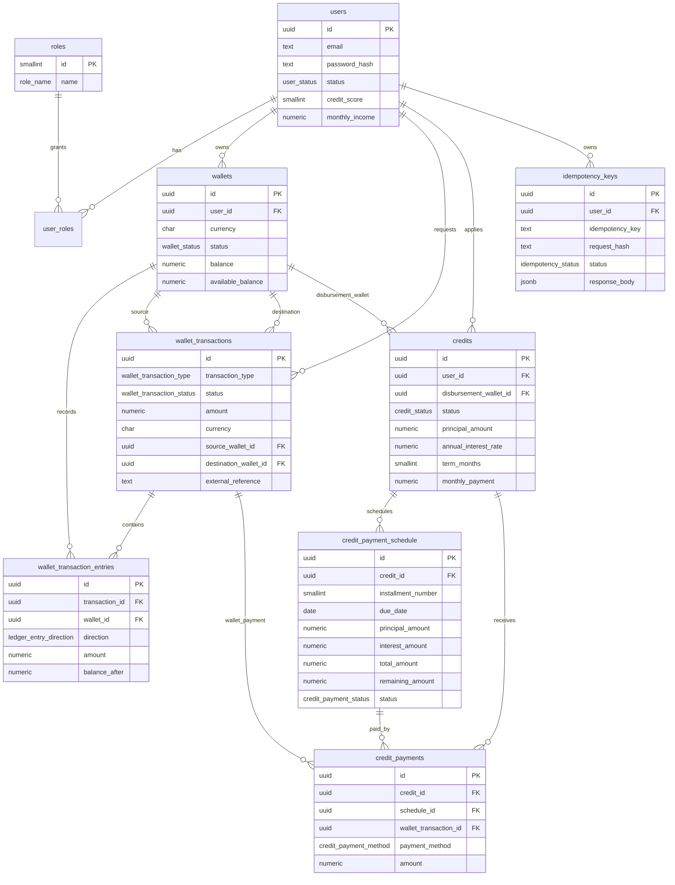

# ER Diagram

```mermaid
erDiagram
    users ||--o{ user_roles : has
    roles ||--o{ user_roles : grants

    users ||--o{ wallets : owns
    wallets ||--o{ wallet_transaction_entries : records
    wallet_transactions ||--o{ wallet_transaction_entries : contains

    wallets ||--o{ wallet_transactions : source
    wallets ||--o{ wallet_transactions : destination
    users ||--o{ wallet_transactions : requests

    users ||--o{ credits : applies
    wallets ||--o{ credits : disbursement_wallet
    credits ||--o{ credit_payment_schedule : schedules
    credits ||--o{ credit_payments : receives
    credit_payment_schedule ||--o{ credit_payments : paid_by
    wallet_transactions ||--o{ credit_payments : wallet_payment

    users ||--o{ idempotency_keys : owns

    users {
        uuid id PK
        text email
        text password_hash
        user_status status
        smallint credit_score
        numeric monthly_income
    }

    roles {
        smallint id PK
        role_name name
    }

    wallets {
        uuid id PK
        uuid user_id FK
        char currency
        wallet_status status
        numeric balance
        numeric available_balance
    }

    wallet_transactions {
        uuid id PK
        wallet_transaction_type transaction_type
        wallet_transaction_status status
        numeric amount
        char currency
        uuid source_wallet_id FK
        uuid destination_wallet_id FK
        text external_reference
    }

    wallet_transaction_entries {
        uuid id PK
        uuid transaction_id FK
        uuid wallet_id FK
        ledger_entry_direction direction
        numeric amount
        numeric balance_after
    }

    credits {
        uuid id PK
        uuid user_id FK
        uuid disbursement_wallet_id FK
        credit_status status
        numeric principal_amount
        numeric annual_interest_rate
        smallint term_months
        numeric monthly_payment
    }

    credit_payment_schedule {
        uuid id PK
        uuid credit_id FK
        smallint installment_number
        date due_date
        numeric principal_amount
        numeric interest_amount
        numeric total_amount
        numeric remaining_amount
        credit_payment_status status
    }

    credit_payments {
        uuid id PK
        uuid credit_id FK
        uuid schedule_id FK
        uuid wallet_transaction_id FK
        credit_payment_method payment_method
        numeric amount
    }

    idempotency_keys {
        uuid id PK
        uuid user_id FK
        text idempotency_key
        text request_hash
        idempotency_status status
        jsonb response_body
    }
```
